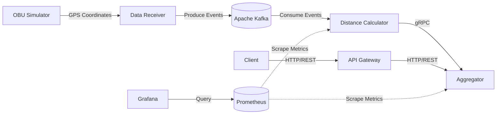

# Toll Calculator

A distributed toll calculation system that processes real-time vehicle GPS coordinates via Apache Kafka and calculates toll invoices using a microservices architecture communicating over gRPC and HTTP REST APIs.

## Architecture



### Components

| Service | Description | Integration |
|---|---|---|
| `obu` | Simulates On-Board Units sending vehicle GPS coordinates. | N/A |
| `data_receiver` | Receives incoming OBU data and publishes it to the message broker. | HTTP |
| `dist-calc` | Consumes Kafka events to compute the distance traveled. | Kafka |
| `aggregator` | Aggregates computed distances and calculates total invoices. | gRPC |
| `gateway` | API gateway exposing client-facing endpoints. | HTTP/REST |
| `prometheus` | Scrapes and stores application metrics. | HTTP |
| `grafana` | Visualizes metrics data via interactive dashboards. | HTTP |

## Technical Stack

- **Core:** Go
- **Protocols:** gRPC for internal inter-service communication, HTTP/REST for client-facing APIs
- **Message Broker:** Apache Kafka for real-time data streaming
- **Observability:** Prometheus for monitoring application metrics (request counters, error rates, latency) and Grafana for visual dashboards
- **Serialization:** Protocol Buffers for efficient data transport

## Local Setup

### Prerequisites
- Docker and Docker Compose
- Go 1.20 or higher
- Make

### Installation

1. **Start Infrastructure:**
   Initialize Apache Kafka, Prometheus, Grafana, and related dependencies via Docker.
   ```bash
   docker-compose up -d
   ```

2. **Generate Protocol Buffers:**
   Compile the gRPC and Protobuf definitions.
   ```bash
   make proto
   ```

3. **Run Services:**
   Start each microservice. It is recommended to run each in a separate terminal instance.
   ```bash
   make aggregator
   make calc
   make receiver
   make gate
   make obu
   ```

## API Reference

### Get Invoice
Retrieves the total toll invoice for a specific On-Board Unit.

**Request:**
```http
GET /invoice?obu=<obu_id>
```