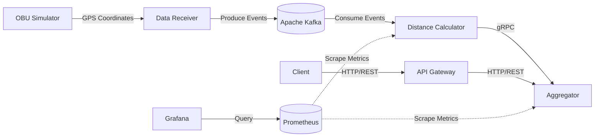

# Toll Calculator

A distributed toll calculation system that processes real-time vehicle GPS coordinates via Apache Kafka and calculates toll invoices using a microservices architecture communicating over gRPC and HTTP REST APIs.

## Architecture



### Components

| Service | Description | Integration |
|---|---|---|
| `obu` | Simulates On-Board Units sending vehicle GPS coordinates. | N/A |
| `data_receiver` | Receives incoming OBU data and publishes it to the message broker. | WebSocket/Kafka |
| `dist-calc` | Consumes Kafka events to compute the distance traveled. | Kafka |
| `aggregator` | Aggregates computed distances and calculates total invoices. | gRPC |
| `gateway` | API gateway exposing client-facing endpoints. | HTTP/REST |
| `prometheus` | Scrapes and stores application metrics. | HTTP |
| `grafana` | Visualizes metrics data via interactive dashboards. | HTTP |

## Technical Stack

- **Core:** Go
- **Protocols:** gRPC for internal inter-service communication, HTTP/REST for client-facing APIs
- **Message Broker:** Apache Kafka for real-time data streaming
- **Observability:** Prometheus for monitoring application metrics (request counters, error rates, latency) and Grafana for visual dashboards
- **Serialization:** Protocol Buffers for efficient data transport

## Sandbox bootstrap

### Prerequisites

- Docker and Docker Compose
- Make

Start the complete isolated stack with one command:

```bash
make bootstrap
```

This builds the Go services and starts Kafka, the aggregator, receiver,
calculator, gateway, OBU generator, Prometheus, and Grafana in Docker. Published
ports bind only to `127.0.0.1`, so they are reachable from the local sandbox host
without being exposed on every network interface.

Useful bootstrap commands are:

```bash
make bootstrap-build   # build images without starting them
make bootstrap-status  # show container state and published ports
make bootstrap-logs    # follow logs from every service
make bootstrap-down    # stop containers and preserve benchmark data
make bootstrap-reset   # stop containers and remove Kafka/metrics volumes
```

To confirm the sandbox is running:

```bash
docker compose ps
curl http://127.0.0.1:4000/metrics
curl 'http://127.0.0.1:6000/invoice?obu=1'
```

The invoice request may initially return not-found until an OBU has emitted at
least one event and the pipeline has processed it. Open these local interfaces:

| Interface | Address | What to inspect |
|---|---|---|
| Gateway | <http://127.0.0.1:6000/invoice?obu=1> | Public invoice response |
| Aggregator metrics | <http://127.0.0.1:4000/metrics> | Business, HTTP, gRPC, and pipeline metrics |
| Receiver metrics | <http://127.0.0.1:30000/metrics> | WebSocket and Kafka producer metrics |
| Calculator metrics | <http://127.0.0.1:9102> | Consumer, lag, distance, and downstream metrics |
| OBU metrics | <http://127.0.0.1:9100> | Offered load and write metrics |
| Prometheus | <http://127.0.0.1:9090/targets> | Scrape-target health and metric queries |
| Grafana | <http://127.0.0.1:3000> | Explore the preconfigured Prometheus source (`admin` / `admin`) |

The sandbox defaults to gRPC internally. To compare the HTTP path or change the
offered load, recreate the stack with environment overrides:

```bash
AGGREGATOR_PROTOCOL=http OBU_COUNT=100 OBU_EVENT_RATE=500 \
  OBU_CONNECTIONS=10 make bootstrap
```

Docker Compose persists Kafka, Prometheus, and Grafana data in named volumes.
Use `make bootstrap-reset` when a benchmark needs a clean run.

## Native local development

Native development requires Go 1.26 or higher, a local Kafka listener on
`localhost:9092`, and Make. Start Kafka alone with
`docker compose up -d broker`, then run each service in a separate terminal:

```bash
make aggregator
make receiver
make calc
make gate
make obu
```

Regenerate protobuf code only after changing `types/ptypes.proto`:

```bash
make proto
```

The local defaults line up without extra configuration: the receiver listens on
`:30000`, the aggregator listens on HTTP `:4000` and gRPC `:3001`, and the
distance calculator uses gRPC. Events use the OBU ID as their Kafka key. Kafka
offsets are committed only after aggregation succeeds; event IDs make replayed
aggregation idempotent.

## Configuration

The distance calculator transport is selected explicitly:

| Variable | Default | Purpose |
|---|---:|---|
| `AGGREGATOR_PROTOCOL` | `grpc` | Internal transport, `http` or `grpc` |
| `AGGREGATOR_HTTP_ADDR` | `http://localhost:4000` | Aggregator HTTP client target |
| `AGGREGATOR_GRPC_ADDR` | `localhost:3001` | Aggregator gRPC client target |
| `AGGREGATOR_REQUEST_TIMEOUT` | `2s` | Per-event downstream deadline |
| `KAFKA_BROKERS` | `localhost:9092` | Kafka bootstrap servers |
| `KAFKA_TOPIC` | `obudata` | GPS event topic |
| `KAFKA_GROUP_ID` | `tollify-distance-calculator` | Consumer group |

For containers, use service DNS names such as
`AGGREGATOR_HTTP_ADDR=http://aggregator:4000` and
`AGGREGATOR_GRPC_ADDR=aggregator:3001`.

Receiver controls include `RECEIVER_HTTP_ADDR`, `WS_ALLOWED_ORIGINS` (a
comma-separated exact allowlist; `*` explicitly allows all), and
`WS_READ_LIMIT_BYTES`. Requests without an `Origin` header and same-host browser
origins are accepted by default.

## Load generation

The OBU executable supports fixed-arrival-rate and maximum-throughput tests. A
finite fixed-rate example is:

```bash
go run ./obu -obus 100 -connections 10 -rate 500 -duration 2m \
  -payload-bytes 256 -seed 42
```

A ramp test and a saturation test are:

```bash
go run ./obu -obus 100 -connections 10 -ramp '30s:100,30s:500,1m:1000'
go run ./obu -obus 100 -connections 10 -mode max -duration 1m
```

The generator prints a JSON summary containing attempts, successful writes,
failures, elapsed time, and achieved write rate. Environment equivalents are
available as `OBU_COUNT`, `OBU_EVENT_RATE`, `OBU_CONNECTIONS`,
`OBU_TEST_DURATION`, `OBU_PAYLOAD_BYTES`, `OBU_LOAD_MODE`, `OBU_RANDOM_SEED`,
and `OBU_RAMP_SCHEDULE`.

The summary also contains a count-independent event-ID fingerprint (`xor` and
`sum`). Compare it with `GET /benchmark/reconciliation` on the aggregator. A
matching event count and both matching fingerprints provide a compact check that
the successfully written event-ID set is the set uniquely applied to invoices.

## Metrics and benchmark separation

Prometheus endpoints are exposed by the OBU generator (`:9100`), receiver
(`/metrics` on `:30000`), distance calculator (`:9102`), and aggregator
(`/metrics` on `:4000`). The metric layers are intentionally separate:

- `tollify_aggregation_operation_duration_seconds` measures store/business work.
- HTTP and gRPC client/server histograms measure transport round trips.
- `tollify_pipeline_event_duration_seconds` measures source creation through an
  idempotent invoice-state update.

Compare HTTP and gRPC with the same payload, rate, deadlines, store, and process
limits, changing only `AGGREGATOR_PROTOCOL`. Both clients reuse long-lived
connections. Do not use a race-enabled build for latency measurements.

The default Prometheus registry also exports Go runtime and process CPU, memory,
goroutine, GC, file-descriptor, and related metrics. Use Docker/host monitoring
(for example cAdvisor) for container network-byte and cgroup resource metrics;
those cannot be measured accurately from one application process.

## Correctness checks

Run these before collecting performance results:

```bash
go test ./...
go test -race ./...
go vet ./...
```

The in-memory idempotency and invoice state are suitable for a single local
aggregator benchmark. Multiple aggregator replicas require a shared persistent
store with atomic updates and a unique event-ID constraint. Coordinates are
treated as synthetic Cartesian points; the calculator does not claim geographic
Haversine distance.

## API Reference

### Get Invoice
Retrieves the total toll invoice for a specific On-Board Unit.

**Request:**
```http
GET /invoice?obu=<obu_id>
```
