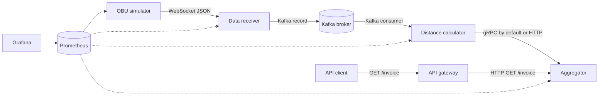

# System Architecture

## Purpose

Tollify receives GPS positions from simulated on-board units (OBUs), calculates
the distance travelled by each OBU, and turns the total distance into a toll
invoice.

The write path processes GPS events. The read path returns an invoice. They meet
inside the aggregator, which owns the current invoice state.



## Components

| Component | Default port | Input | Output | State |
|---|---:|---|---|---|
| OBU simulator | `9100` metrics | Load settings | WebSocket GPS events | Run counters and event sequence |
| Data receiver | `30000` | WebSocket JSON | Kafka records | Active connection set |
| Kafka broker | `9092` host, `29092` containers | Kafka records | Ordered partition records | Kafka volume |
| Distance calculator | `9102` metrics | Kafka records | Distance updates over gRPC or HTTP | Previous point and replay result per event |
| Aggregator | `4000` HTTP, `3001` gRPC | Distance updates and invoice reads | Stored totals and invoice JSON | In-memory totals and processed event IDs |
| API gateway | `6000` | Public HTTP request | Aggregator HTTP request | No business state |
| Prometheus | `9090` | Metrics endpoints | Time-series queries | Prometheus volume |
| Grafana | `3000` | Prometheus queries | Dashboards | Grafana volume |

## Shared event data

The source timestamp and event ID are created once by the OBU and kept through
every write-path service.

```go
type OBUData struct {
    EventID            string  `json:"event_id"`
    ProducedAtUnixNano int64   `json:"produced_at_unix_nano"`
    OBUID              int     `json:"obu_id"`
    Lat                float64 `json:"lat"`
    Lon                float64 `json:"lon"`
    Payload            string  `json:"payload,omitempty"`
}
```

After distance calculation, the calculator sends this smaller business value:

```go
type Distance struct {
    EventID            string  `json:"event_id"`
    ProducedAtUnixNano int64   `json:"produced_at_unix_nano"`
    Value              float64 `json:"value"`
    OBUID              int     `json:"obu_id"`
}
```

The public read result is:

```go
type Invoice struct {
    OBUID     int     `json:"obu_id"`
    TotalDist float64 `json:"total_distance"`
    Amount    float64 `json:"amount"`
}
```

## Delivery and duplicate handling

Kafka auto-commit is disabled. A valid record is committed only after the
aggregator call succeeds. If the call fails, the calculator seeks back to the
same Kafka offset and tries it again.

An aggregator call can succeed even when the reply is lost. The next attempt
would then carry the same event ID. The calculator caches the distance for a
replayed event, and the aggregator stores processed event IDs. This prevents the
same distance from being added twice while the processes stay alive.

## Ordering

The receiver uses the OBU ID as the Kafka key:

```go
Key: []byte(strconv.Itoa(data.OBUID))
```

Kafka sends records with the same key to the same partition. This helps keep
events for one OBU in order when the topic has more than one partition.

## Current storage limits

The calculator and aggregator use in-memory maps. Restarting either service
loses its local state. Kafka, Prometheus, and Grafana use Docker volumes, but
invoice totals do not.

This is suitable for a local single-instance benchmark. A production design
would use shared durable storage for invoice totals, processed event IDs, and
calculator position state before adding replicas.
